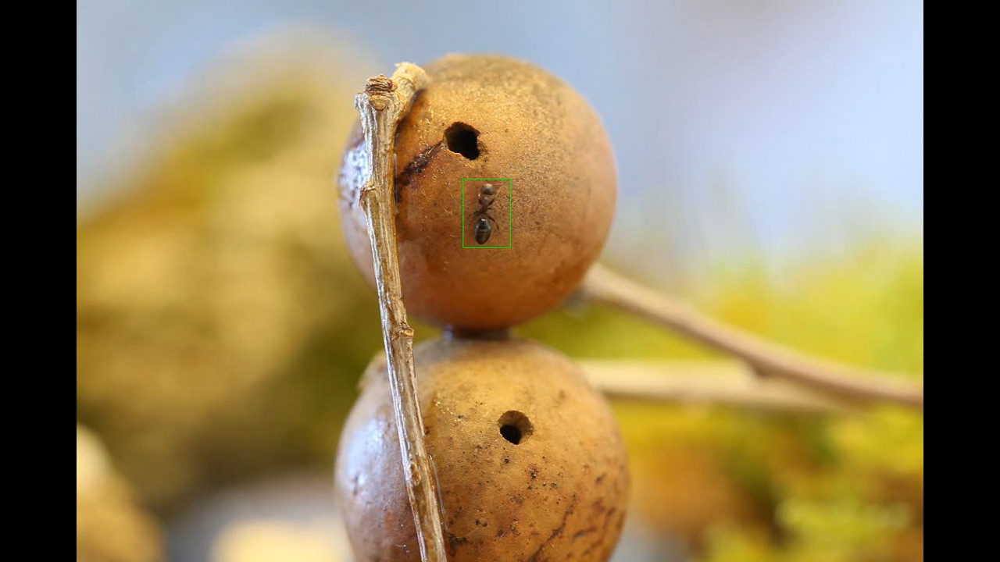
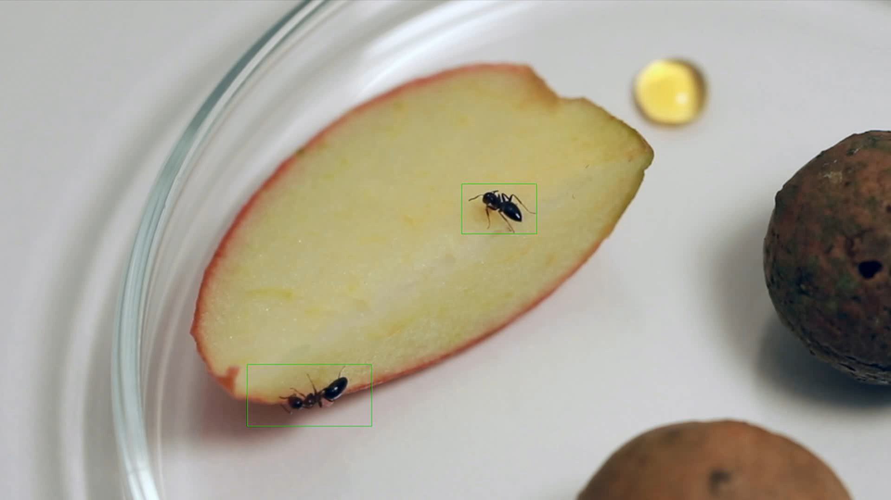
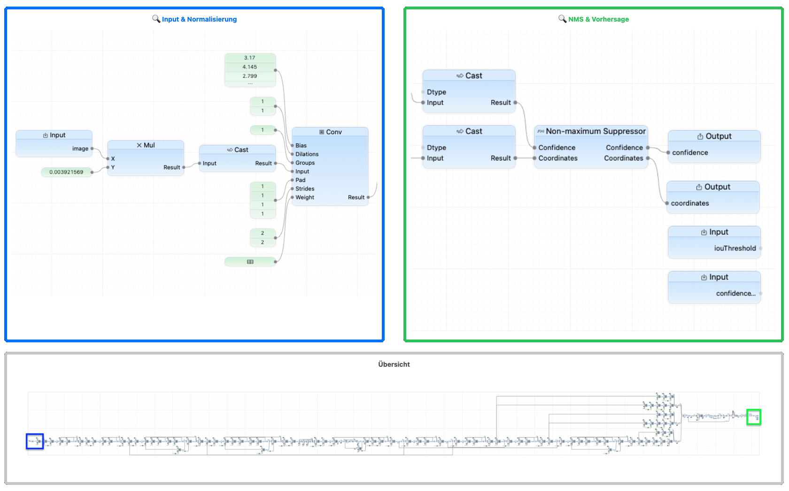

# Ameisen Erkennung

Das Repository umfasst zwei Tools: eines zur Erstellung von Trainingsdaten für Objekterkennung (🐜) und eines zur Anwendung des erstellten Modells (Yolo11n) für KI basierte Objekterkennung in Video Aufnahmen. 

## Beispiele

### Erkennung in "gewohnter" Umgebung

<a href="[https://youtu.be/oRAOLdAEDis](https://youtu.be/oRAOLdAEDis)">▶ Video (original 1024×680)): Ähnliche Umgebung</a>

Link: [https://youtu.be/oRAOLdAEDis](https://youtu.be/oRAOLdAEDis)

### Erkennung in anderer Umgebung

<a href="[https://youtu.be/6Ip_ltdO_YU](https://youtu.be/6Ip_ltdO_YU)">▶ Video (original 1920×1080): Andere Umgebung</a>

Link: [https://youtu.be/6Ip_ltdO_YU](https://youtu.be/6Ip_ltdO_YU)

## Module

* **[Dataset Generator](./dataset/README.md)** (`/dataset`)
  Ein plattformunabhängiges C++ Kommandozeilen-Werkzeug zur automatischen Extraktion von Frames und Generierung von Bounding-Box-Annotationen aus Videoclips.

* **[Inferenz](./inferenz/README.md)** (`/inferenz`)
  Tools zur Ausführung des trainierten YOLO11-Modells. Enthält Implementierungen für **macOS (CoreML/C++)** und **Linux (PyTorch/Python)** zur Video-Verarbeitung und Live-Erkennung.

## Modell

Strukturdarstellung der Yolo 11n Modellklasse in Xcode:

## Lizenzen

Aufgrund der Nutzung von Ultralytics YOLO11 Modellen, die dem Repo im Inferenz Modul in zwei Formaten beiliegen, gelten für die Module in diesem Repository unterschiedliche Lizenzbedingungen. Die Lizenzen sind strikt auf die jeweiligen Unterverzeichnisse beschränkt:

* Der Code im Verzeichnis **`dataset`** unterliegt der Lizenz in [`dataset/LICENSE`](./dataset/LICENSE).
* Der Code im Verzeichnis **`inferenz`** nutzt Ultralytics YOLO11 und unterliegt den Bedingungen in [`inferenz/LICENSE`](./inferenz/LICENSE) (in der Regel AGPL-3.0).

Bitte beachte die jeweiligen `LICENSE`-Dateien in den Unterverzeichnissen für verbindliche Details.