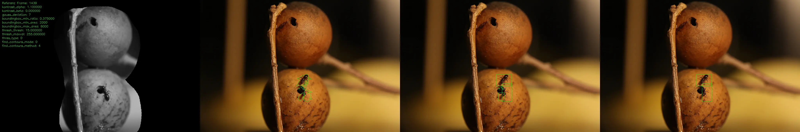
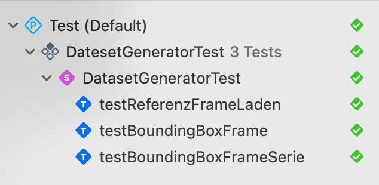

# Trainings Datensatz Generierung mit OpenCV

Das Tool durchläuft Video Aufnahmen und erkennt Frames mit "Objekten", also visuelle Differenz Bereiche zu Referenz Bildern, und gibt sie als Bild-Dateien und "Bounding-Box-Annotationen" in Text-Files aus. 

Die Dateien können als Trainingsdaten für die Objekterkennung (YOLO) oder zur Auswahl und Annotationen Verbesserung mit anderen Tools verwendet werden.

## Implementierung

Es gibt gibt zwei Implementierungen. Einmal für macOS mit den Apple Developer Tools und `Xcode` und einmal für das Standard Linux Entwicklungsetup mit `cmake`.

Siehe [Setup](#setup).

## Funktion

* **Setup und Konfiguration**: Anlage fehlender Verzeichnisse beim Programmstart. Automatisches Kopieren von Standarddateien aus `dataset/config/`, falls im Zielordner keine spezifische `clip.json` oder `maske_sw.png` vorliegt.
* **Initialisierung von Referenzbildern**: Vorab-Generierung von Referenzbildern aus dem Videoclip vor dem eigentlichen Durchlauf. Definition von Stützpunkten für Referenzbilder in `clip.json` (Start- und End-Frames).
* **Maskierung**: Anwendung von `maske_sw.png` zum Ausblenden von Bildbereichen (z. B. Bereiche wo kein Objekte erkannt werden sollen).
* **Bewegungserkennung**: Abgleich von aktuellen Video-Frames mit dem Referenzbild, um veränderte Bereiche zu erkennnen. Erstellung von Bounding-Boxen um diese Zonen.
* **Dynamische Adaption**: Wechsel von Referenzbildern zur Kompensation von veränderten Lichtverhältnissen oder kleinen Abweichungen vom Bildausschnitt über längere Zeiträume (gesteuert über Algorithmus und `clip.json`).
* **Filterung**: Auswahl von einzelnen Frames aus Serien "gleicher" Ansichten, um "redundante" Serienbilder zu vermeiden.
* **Export**: Speichern der Frames und zugehöriger Textdateien im `yolo/`.

### Eingabe

#### Übergabe Werte:

Das Eingabe Video wird per Übergabe Parameter angegeben.

Aufruf Syntax:

```text
Dataset <kennung> <pfad>
```

Die Aufnahme wird dann unter `<pfad>\clip_<kennung>.mp4` gesucht.

#### Sonstige:

Es werden zwei Dateien für die Verarbeitung unter `dataset/data/<kennung>/` als Input verwendet: `clip.json` und `maske_sw.png`.

* `clip.json`: ist eine Steuerdatei für Referenz-Frames.
* `maske_sw.png`: ist eine Schwarz-Weiß-Maske zum Ausblenden irrelevanter Bildbereiche.

`dataset/data/<kennung>/` wird beim ersten Aufruf angelegt, falls nicht vorhanden. 

`dataset/config/clip.json` und `dataset/config/maske_sw.png` werden standardmäßig, falls in `dataset/data/<kennung>/` nicht vorhanden, dorthin kopiert und verwendet.

* `clip.json`: ist eine Steuerdatei für Referenz-Frames.

### Ausgabe

Erstellung von `dataset/data/<kennung>/` und darin einiger Projektverzeichnisse beim Start:

* `yolo/`: Speicherort für exportierte `.jpg`-Frames und `.txt`-Labeldateien mit Bounding-Boxen.
* `debug/`: Speicherort für visuelle Überprüfungen und Zwischenschritte.
* `ml/`: Speicherort für Modell Generierungsfiles für andere Tools.

### Beispiel

Unter `dataset/data/<kennung>/yolo` werden solche Frames mit erkannten Veränderungsbereichen als `frame_<frame_nr>.jpg` gespeichert:

<div align="center">
<br/>

<div align="center">
    Frame, in dem zwei Objekte erkannt wurden
</div>
</div>

Unter `dataset/data/<kennung>/debug` werden solche Übersichtsbilder zur Kontrolle gespeichert (inklusive Darstellung der Parameter und letzter Zwischenschritte):

<div align="center">
<br/>

<div align="center">
    Für Debugging und Feinabstimmung von Parametern
</div>
</div>

Zugehörige Annotation (siehe [docs/annotation.txt](./docs/annotation.txt)):

```
0 0.534668 0.701471 0.0498047 0.138235
0 0.52002 0.608088 0.0771484 0.0897059
```

Das Frame als `jpg` Bild-Datei und ein Annotaion `txt` Datei würden im `yolo/` Verzeichnis gespeichert:

```text
frame_<frame_nr>.jpg
frame_<frame_nr>.txt
```

## Setup

Es gibt gibt zwei Implementierungen. Einmal für macOS mit den Apple Developer Tools und `Xcode` und einmal für das Standard Linux Entwicklungsetup mit `cmake`.

Das Tool selbst hat für beides dieselbe `C++` Code Basis unter [./Dataset/](./Dataset/)

Für die kleinen Testumfäge werden unterschiedliche Sourcen verwendet.

Unter macOS `Xcode` kommt `XCTest` zum Einsatz und deswegen [DatasetGeneratorTest.mm](./Test/DatasetGeneratorTest.mm) als `Objective C++` Test-Suite.

Unter Linux kommt `gtest` zum Einsatz und eine [DatasetGeneratorTest.cpp](./Test/DatasetGeneratorTest.cpp) als `C++` Test-Suite.

### Setup unter macOS

Unter macOS müssen `Xcode` und `Homebrew` installiert sein.

#### Installationen

Mit `brew` nachinstallieren:

```bash
brew install opencv nlohmann-json
```

#### Öffnen

`Dataset.xcodeproj` mit Xcode öffnen.

#### Bauen

**In Xcode**
- Build mit `⌘B`

**Im Terminal**
Projekt im Release-Modus inkl. aller `.xcconfig` Abhängigkeiten über `xcodebuild` kompilieren:

```bash
xcodebuild -project Dataset.xcodeproj -scheme Dataset -configuration Release clean build
```

#### Ausführen

Übergabe der Parameter `<clip_kennung>` und `<video_ordner_pfad>`.

**In Xcode**

Hinterlegen der Startparameter für den direkten Start per Shortcut:
- Öffnen der Scheme-Einstellungen über `Product` -> `Scheme` -> `Edit Scheme...` (oder `⌘<`)
- Auswahl des Reiters **Run** und des Sub-Tabs **Arguments**
- Hinzufügen der beiden Parameter unter "Arguments Passed On Launch" (z.B. `20250415_1646` und `/Volumes/HD16/clips/ants`)
- Starten des Programms mit `⌘R`

**Im Terminal**

Starten der kompilierten (`⌘B`) ausführbaren Datei aus dem lokalen Build-Verzeichnis:

(Pfad anpassen, falls im Release-Modus gebaut wurde)

```bash
cd dataset/build/Debug
./Dataset 20250415_1646 /Volumes/HD16/clips/ants
```

#### Testen

Für den Testlauf gibt es für das Target `Dataset` einen _default_ `Test` genannten Testplan im `Xcode` Projekt.

**In Xcode**

* **`Dataset`** als Target auswählen
* `⌘U` für Starten des Testlaufs
* In `Xcode` Projekt im `Test Navigator` wird das Ergebnis angezeigt.

<div align="center">

<div align="center">
In Xcode: Testplan mit Ansicht im Erfolgsfall
</div>
</div>

**Im Terminal**

XCTests im Terminal starten:

```bash
xcodebuild -project Dataset.xcodeproj -scheme Dataset test
```

Ausgabe:

```bash
...
Testing started
Test Suite 'Selected tests' started at 2026-02-24 06:52:25.395.
Test Suite 'DatesetGeneratorTest.xctest' started at 2026-02-24 06:52:25.396.
Test Suite 'DatasetGeneratorTest' started at 2026-02-24 06:52:25.396.
Test Case '-[DatasetGeneratorTest testBoundingBoxFrame]' started.
🏁 Starte Testcase: BoundingBox-Anzahl...
Test Case '-[DatasetGeneratorTest testBoundingBoxFrame]' passed (0.247 seconds).
Test Case '-[DatasetGeneratorTest testBoundingBoxFrameSerie]' started.
🏁 Starte Testcase: BoundingBox-Anzahl...
Test Case '-[DatasetGeneratorTest testBoundingBoxFrameSerie]' passed (0.493 seconds).
Test Case '-[DatasetGeneratorTest testReferenzFrameLaden]' started.
🏁 Starte Testcase: BoundingBox-Anzahl...
Test Case '-[DatasetGeneratorTest testReferenzFrameLaden]' passed (0.042 seconds).
Test Suite 'DatasetGeneratorTest' passed at 2026-02-24 06:52:26.180.
	 Executed 3 tests, with 0 failures (0 unexpected) in 0.782 (0.784) seconds
Test Suite 'DatesetGeneratorTest.xctest' passed at 2026-02-24 06:52:26.180.
	 Executed 3 tests, with 0 failures (0 unexpected) in 0.782 (0.784) seconds
Test Suite 'Selected tests' passed at 2026-02-24 06:52:26.180.
	 Executed 3 tests, with 0 failures (0 unexpected) in 0.782 (0.785) seconds
2026-02-24 06:52:26.516 xcodebuild[2273:28684] [MT] IDETestOperationsObserverDebug: 1.930 elapsed -- Testing started completed.
2026-02-24 06:52:26.516 xcodebuild[2273:28684] [MT] IDETestOperationsObserverDebug: 0.000 sec, +0.000 sec -- start
2026-02-24 06:52:26.516 xcodebuild[2273:28684] [MT] IDETestOperationsObserverDebug: 1.930 sec, +1.930 sec -- end

Test session results, code coverage, and logs:
	./dataset/build/Dataset/Logs/Test/Test-Dataset-2026.02.24_06-52-23-+0100.xcresult

** TEST SUCCEEDED **
```

### Setup unter Linux 

Unter Linux (hier Arch Linux) wird der Build über `CMake` gemacht.

#### Installationen

Die Entwicklungswerkzeuge, Bibliotheken und das Google Test Framework installieren:

```bash
sudo pacman -S base-devel cmake opencv nlohmann-json gtest
```
#### Bauen

Das Projekt wird im `build`-Verzeichnis kompiliert:

Im `dataset` Verzeichnis:

```bash
mkdir build
```

```bash
cd build
cmake .. -DCMAKE_BUILD_TYPE=Release
make
```

#### Ausführen

Nach dem  Build liegt das Tool `Dataset` im `build`-Ordner.

```bash
./Dataset <clip_kennung> <video_ordner_pfad>
```

**Beispiel:**

```bash
./Dataset 20250404_1248 /mnt/DatenArchiv/Clips/Ameisen
```

Ausgabe:

```bash
default_config_path: ants-detection-pfad/dataset/config/
set_path: ants-detection-pfad/dataset/data/20250404_1248/
maske_bw_path: ants-detection-pfad/dataset/data/20250404_1248/maske_sw.png
json_path: ants-detection-pfad/dataset/data/20250404_1248/clip.json
debug_path: ants-detection-pfad/dataset/data/20250404_1248/debug/
yolo_path: ants-detection-pfad/dataset/data/20250404_1248/yolo/
ml_path: ants-detection-pfad/dataset/data/20250404_1248/ml/
clip_path: /mnt/DatenArchiv/Clips/Ameisen/clip_20250404_1248.mp4
🐜 zuerst bei Frame 0
🐜 zuletzt bei Frame 1949
Datensatz erstellt bei Frame 1
🐜 zuerst bei Frame 1956
🐜 zuletzt bei Frame 1960
Datensatz erstellt bei Frame 1957
🐜 zuerst bei Frame 1963
🐜 zuletzt bei Frame 1963
Datensatz erstellt bei Frame 1964
🐜 zuerst bei Frame 1965
...
```

#### Testen

Die Tests werden beim Ausführen von `make` automatisch mitgebaut.

Die Testsuite kann man im `build`-Ordner starten:

```bash
./DatasetTest
```

Das Terminal zeigt dann eine Auswertung der einzelnen Testcases (z.B. Lade Referenz-Frame, Bounding-Box Generierung) inklusive Ausführungsdauer:

```bash
[==========] Running 3 tests from 1 test suite.
[----------] Global test environment set-up.
[----------] 3 tests from DatasetGeneratorTest
[ RUN      ] DatasetGeneratorTest.ReferenzFrameLaden
🏁 Starte Testcase...
[       OK ] DatasetGeneratorTest.ReferenzFrameLaden (77 ms)
[ RUN      ] DatasetGeneratorTest.BoundingBoxFrame
🏁 Starte Testcase...
[       OK ] DatasetGeneratorTest.BoundingBoxFrame (32 ms)
[ RUN      ] DatasetGeneratorTest.BoundingBoxFrameSerie
🏁 Starte Testcase...
[       OK ] DatasetGeneratorTest.BoundingBoxFrameSerie (164 ms)
[----------] 3 tests from DatasetGeneratorTest (274 ms total)

[----------] Global test environment tear-down
[==========] 3 tests from 1 test suite ran. (274 ms total)
[  PASSED  ] 3 tests.
```

## Parametrierung

Damit die Bereiche mit OpenCV gut erkannt werden, gibt es diverse Parameter, die nachjustiert werden können.

Die Parameter müsssen im Source Code eingestellt werden. Danach müssen dei Targets neu gebaut werden.

Für das Tool sind die Parameter in [`main.cpp`](./Dataset/main.cpp) in der Funktion `setUp` zu finden.

Für die Tests werden die Parameter aus `setUp` in [`DatasetGeneratorTest.cpp`](./Test/DatasetGeneratorTest.cpp) bzw. in [`DatasetGeneratorTest.mm`](./Test/DatasetGeneratorTest.mm) verwendet.

Hier können durch Ein-/Auskommentieren eigene Config-Sets angelegt und aktiviert werden:

```cpp
void setUp(const std::string& arg_clip_kennung, const std::string& arg_video_ordner) {
    config.debug = 0;
    
    // config set 1
    /*
    ...
    */

    // config set 2
    config.gauss_deviation = 7;
    config.thresh_thresh = 15.0;
    config.boundingbox_min_area = 2000;
    config.boundingbox_max_area = 6000;
    config.boundingbox_min_ratio = 0.375;
    config.kontrast_alpha = 1.1;
    config.kontrast_beta = 0;
    ...
}
```

Die voreingestellten Parameter sind so, dass die Testfälle, die auf dem [Test-Clip](./Test/data/clip640x424.mp4) arbeiten, erfolgreich durchlaufen werden.