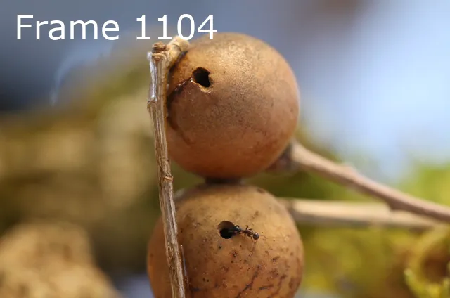
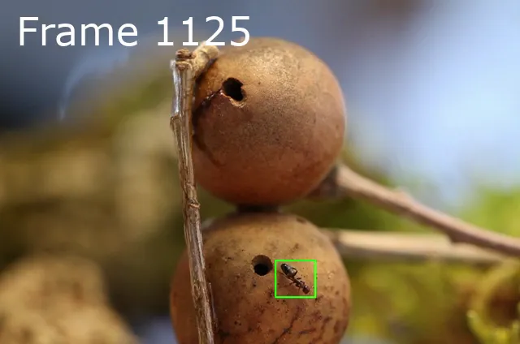

# Objekt Erkennung mit Yolo 

Das Tool erkennt Objekte in einem Video auf Basis eines trainierten Ultralytics YOLOv11n Modells.

Training des Modells zur Objekterkennung (Ameisen) mit einem Datensatz von ca. 1000 Bildern. 

Zur Datensatz Geneierung wurde unter anderem das Tool unter [dateset](./../dataset/) verwendet.

Es wird eine Bild-für-Bild-Analyse einer Videoaufnahme mit Erkennung von Objekten (Ameisen) gemacht und ein neues Video mit eingezeichneten Bounding-Boxen für alle erkannten Objekte erstellt.

## Implementierung

Es gibt zwei Umsetzungen jeweils auf Basis desselben Modells.

Umsetzung mit Objective-C (macOS) [Setup](coreml/README.md#setup).

Umsetzung mit Python, pyTorch, YOLO [Setup](pytorch/README.md#setup).

## Beispiel

Hier ist eine Reihe von Frames aus dem Originalvideo (links) und dem generierten Clip mit Bounding-Boxen (rechts):

<table align="center">
  <thead>
    <tr>
      <th>Original Frame</th>
      <th>Mit Erkennung</th>
    </tr>
  </thead>
  <tbody>
    <tr>
      <td></td>
      <td></td>
    </tr>
    <tr>
      <td></td>
      <td></td>
    </tr>
    <tr>
      <td></td>
      <td></td>
    </tr>
    <tr>
      <td></td>
      <td></td>
    </tr>
    <tr>
      <td></td>
      <td></td>
    </tr>
    <tr>
      <td></td>
      <td></td>
    </tr>
  </tbody>
</table>

## Plattform Benchmarks

Ergebnisse von Testläufen auf ein paar Plattformen mit einem 640x424 Video.

> Die gemessene FPS-Rate umfasst die gesamte Verarbeitung: Einlesen, Erkennung, Zeichnen der Bounding-Boxen und Ausgabe in die Videodatei.

| Implementierung | Plattform | CPU | GPU | Rate | Anmerkungen |
|---|---|---|---|---|---|
| pyTorch | Arch Linux | AMD Ryzen 7 | RTX GPU | ~290 FPS | Batch-Size = 8, half = True |
| pyTorch | Debian | AMD Ryzen 5 PRO 4650GE | | ~12 FPS | OpenVINO, Batch-Size = 1, half = False |
| Core ML | Mac mini M1 | Apple M1 | | ~80 FPS | |
| Core ML | MacBook Air | Intel Core i7 | | ~5 FPS | |